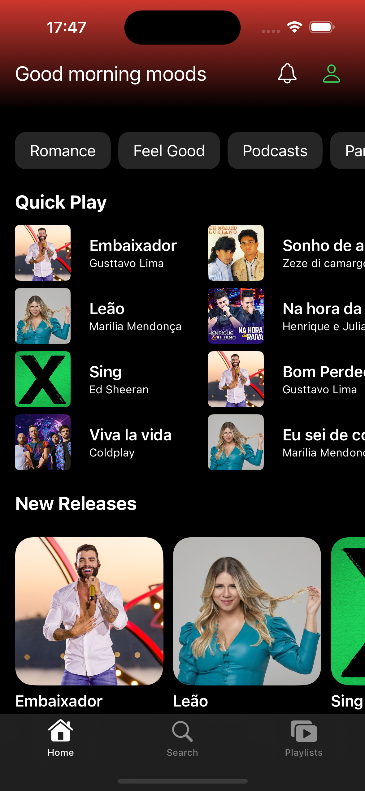
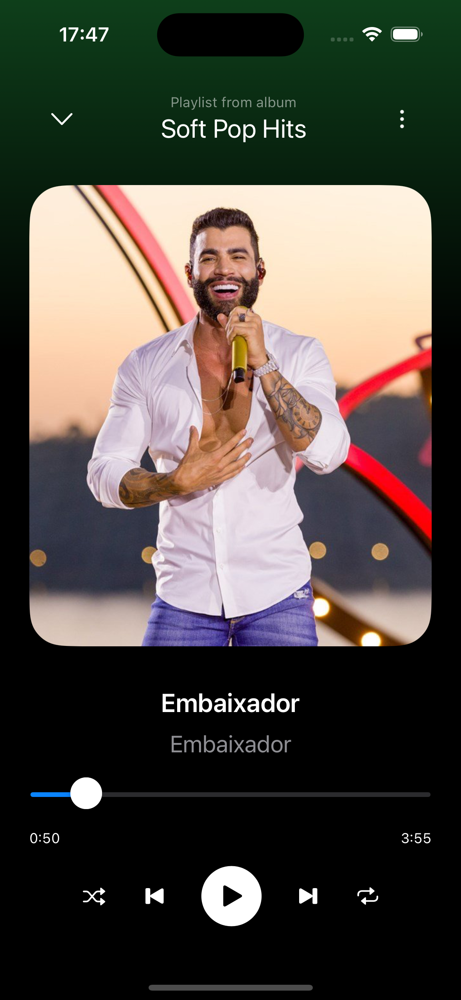

<h1 align="center">
    Music Swift
</h1>
 

Telas do App

    
    

## :rocket: Tecnologias

Esse projeto foi desenvolvido com as seguintes tecnologias:

- [Swift]

- App feito para a prática do swiftUi usando modais, animações e drag and drop para uma interface mais amigavel para o usuário
